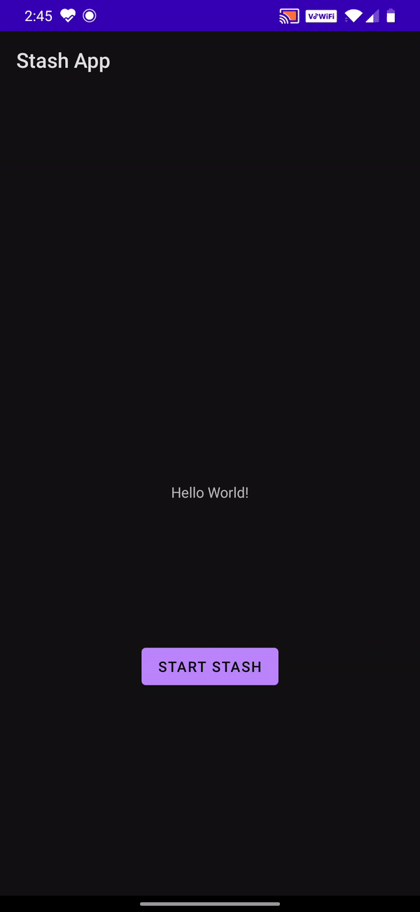

# Stash - Animated Steps Library

Stash is a Android Library for Animated steps.



# Tech Stack
- Livedata
- Fragment
- ViewModels
- MVVM

### Installation
```sh
StepOneFragment::class.qualifiedName?.let { it1 ->
                val build = StashBuilder.builder.setMaximumSteps(4)
                    .setInitialFragmentName(it1)
                    .setInitialFragmentBundle(Bundle().apply {
                        putString(SCREEN_BG, "WHITE")
                        putInt(SCREEN_NUMBER, FRAGMENT_ONE)
                    })
                    .build(this)

                startActivityForResult(build, 5)
            }
```
StepOneFragment = name of initial fragment in view

```sh
class StepOneFragment : StashBaseFragment() {
    override fun showMiniView() {
     // Render Collapsed View in This Method
    }

    override fun showExtendedView() {
    // Render Extended View in This Method
    }

    override val currentScreenPosition: Int
        get() = 0
}
```
 Add Next Screens

```sh
    expandNextScreen(ColorFragment.newInstance(Bundle().apply {
                putString(SCREEN_BG, "RED")
                putInt(SCREEN_NUMBER, screenNumber + 1)
            }))
```
 To Expand current screen and destory next Screens
```sh
     destroyNextScreens()
```

